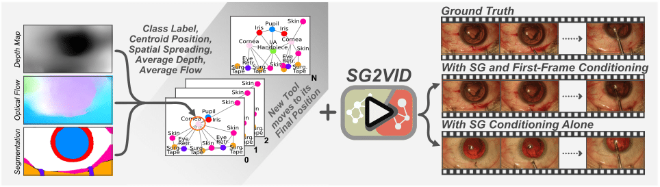

# SG2VID: Scene Graphs Enable Fine-Grained Control for Video Synthesis
  Ssharvien Kumar Sivakumar, Yannik Frisch, Ghazal Ghazaei, Anirban Mukhopadhyay 
  
  
  

-------------------------------------------

## Abstract
Surgical simulation plays a pivotal role in training novice surgeons, accelerating their learning curve and reducing intra-operative errors. However, conventional simulation tools fall short in providing the necessary photorealism and the variability of human anatomy. In response, current methods are shifting towards generative model-based simulators. Yet, these approaches primarily focus on using increasingly complex conditioning for precise synthesis while neglecting the fine-grained human control aspect. To address this gap, we introduce SG2VID, the first diffusion-based video model that leverages Scene Graphs for both precise video synthesis and fine-grained human control. We demonstrate SG2VID’s capabilities across three public datasets featuring cataract and cholecystectomy surgery. While SG2VID outperforms previous methods both qualitatively and quantitatively, it also enables precise synthesis, providing accurate control over tool and anatomy’s size and movement, entrance of new tools, as well as the overall scene layout. We qualitatively motivate how SG2VID can be used for generative augmentation and present an experiment demonstrating its ability to improve a downstream phase detection task when the training set is extended with our synthetic videos. Finally, to showcase SG2VID's ability to retain human control, we interact with the Scene Graphs to generate new video samples depicting major yet rare intra-operative irregularities.

## Code 
Coming Soon!!
