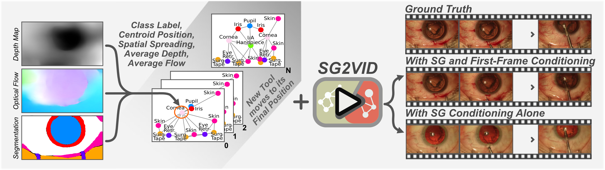

<div id="top" align="center">

# SG2VID: Scene Graphs Enable Fine-Grained Control for Video Synthesis (MICCAI 2025 - ORAL)
  Ssharvien Kumar Sivakumar, Yannik Frisch, Ghazal Ghazaei, Anirban Mukhopadhyay 

  [](https://arxiv.org/abs/2506.03082)
  [](https://ssharvienkumar.github.io/SG2VID/)
  [](https://huggingface.co/SsharvienKumar/SG2VID)

</div>

## 💡Key Features
- First diffusion-based video model that leverages Scene Graphs for both precise video synthesis and fine-grained human control. 
- Outperforms previous methods both qualitatively and quantitatively, it also enables precise synthesis, providing accurate control over tool and anatomy’s size and movement, entrance of new tools, as well as the overall scene layout.
- We qualitatively motivate how SG2VID can be used for generative augmentation and present an experiment demonstrating its ability to improve a downstream phase detection task.
- We showcase SG2VID’s ability to retain human control, we interact with the Scene Graphs to generate new video samples depicting major yet rare intra-operative irregularities.



***This framework provides training scripts for the video diffusion model, supporting both unconditional and conditional training using signals such as the initial frame, scene graph, and text. Feel free to use our work for comparisons and to cite it!***

## 🛠 Setup
```bash
git clone https://github.com/MECLabTUDA/SG2VID.git
cd SG2VID
conda env create -f environment.yaml
conda activate sg2vid
```

## 🏁 Model Checkpoints and Dataset
Download the checkpoints of all the necessary models from the provided sources and place them in `[checkpoints](./checkpoints)`. We also provide the processed CATARACTS, Cataract-1K, Cholec80 dataset, containing images, segmentation masks and their scene graphs. Update the paths of the dataset in `[configs](./configs)`.
- `Checkpoints`: [VAEs, Graph Encoders, Video Diffusion Models](https://huggingface.co/SsharvienKumar/SG2VID/tree/main/checkpoints)
- `Processed Dataset`: [Frames, Segmentation Masks, Scene Graphs](https://huggingface.co/SsharvienKumar/SG2VID/tree/main/datasets)


## 💥 Sampling Videos with SG2VID
Conditioned with initial frame and graph
```bash
python sample.py --inference_config ./configs/inference/inference_img_graph_<dataset_name>.yaml
```

Conditioned with only graph
```bash
python sample.py --inference_config ./configs/inference/inference_ximg_graph_<dataset_name>.yaml
```


## ⏳ Training SG2VID
**Step 1:** Train Image VQGAN and Segmentation VQGAN (For Graph Encoders)
```bash
python sg2vid/taming/main.py --base configs/vae/config_image_autoencoder_vqgan_<dataset_name>.yaml -t --gpus 0, --logdir checkpoints/<dataset_name>
python sg2vid/taming/main.py --base configs/vae/config_segmentation_autoencoder_vqgan_<dataset_name>.yaml -t --gpus 0, --logdir checkpoints/<dataset_name>
```

**Step 2:** Train Another VAE (For Video Diffusion Model)
```bash
python sg2vid/ldm/main.py --base configs/vae/config_autoencoderkl_<dataset_name>.yaml -t --gpus 0, --logdir checkpoints/<dataset_name>

# Converting a CompVis VAE to Diffusers VAE Format
# IMPORTANT: First update Diffusers to version 0.31.0, then downgrade back to 0.21.2
python scripts/ae_compvis_to_diffuser.py \
    --vae_pt_path /path/to/checkpoints/last.ckpt \
    --dump_path /path/to/save/vae_vid_diffusion
```

**Step 3:** Train Both Graph Encoders
```bash
python train_graph.py --name masked --config configs/graph/graph_<dataset_name>.yaml
python train_graph.py --name segclip --config configs/graph/graph_<dataset_name>.yaml
```

**Step 4:** Train Video Diffusion Model

Single-GPU Setup
```bash
python train.py --config configs/training/training_<cond_type>_<dataset_name>.yaml -n sg2vid_training
```

Multi-GPU Setup (Single Node)
```bash
python -m torch.distributed.run \
    --nproc_per_node=${GPU_PER_NODE} \
    --master_addr=127.0.0.1 \
    --master_port=29501 \
    --nnodes=1 \
    --node_rank=0 \
    train.py \
    --config configs/training/training_<cond_type>_<dataset_name>.yaml \
    -n sg2vid_training
```


## ⏳ Training Unconditional Video Diffusion Model
Single-GPU Setup
```bash
python train.py --config configs/training/training_unconditional_<dataset_name>.yaml -n sg2vid_training
```


## 📜 Citations
If you are using SG2VID for your paper, please cite the following paper:
```
@inproceedings{sivakumar2025sg2vid,
  title={Sg2vid: Scene graphs enable fine-grained control for video synthesis},
  author={Sivakumar, Ssharvien Kumar and Frisch, Yannik and Ghazaei, Ghazal and Mukhopadhyay, Anirban},
  booktitle={International Conference on Medical Image Computing and Computer-Assisted Intervention},
  pages={511--521},
  year={2025},
  organization={Springer}
}
```

## ⭐ Acknowledgement
Thanks for the following projects and theoretical works that we have either used or inspired from:
- [SurGrID](https://github.com/SsharvienKumar/SurGrID)
- [ConsistI2V](https://github.com/TIGER-AI-Lab/ConsistI2V)
- [VQGAN](https://github.com/CompVis/taming-transformers)
- [LDM](https://github.com/CompVis/latent-diffusion)
- [SGDiff](https://github.com/YangLing0818/SGDiff)
- [Endora's README](https://github.com/CUHK-AIM-Group/Endora)
